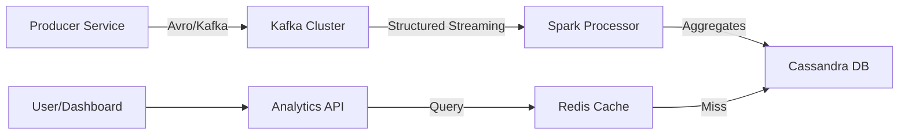

# Platform Architecture

The Real-Time Event Streaming & Analytics Platform is designed for high-throughput, fault-tolerant processing of financial and event-driven data.

## System Overview

### Components

1.  **Kafka Producer (Java/Spring Boot)**
    *   **Role**: Ingests raw events (simulated NYC Taxi data).
    *   **Reliability**: Uses **Idempotent Producers** and **Kafka Transactions** to ensure Exactly-Once Semantics (EOS).
    *   **Throughput**: Configurable throughput with burst capabilities using `RateLimiter`.

2.  **Kafka (Message Broker)**
    *   **Role**: Distributed, persistent log of all events.
    *   **Configuration**: Replication Factor 3 and Partitioning strategy by `transaction_id` for ordering.

3.  **Spark Structured Streaming (Java)**
    *   **Role**: Real-time compute engine.
    *   **Operations**: Windowed aggregations (1m, 5m), watermarking for late data handling, and anomaly detection.
    *   **Persistence**: Writes results to Cassandra via the Spark-Cassandra connector.

4.  **Cassandra (Time-Series DB)**
    *   **Role**: Long-term storage for windowed aggregates.
    *   **Schema**: Optimized for time-series queries using `(merchant_id, window_start)` as the primary key.

5.  **Analytics API (Java/Spring Boot)**
    *   **Role**: Serves aggregates to downstream consumers.
    *   **Optimization**: Implemented **Spring Cache** with **Redis** to minimize Cassandra overhead for "hot" metrics.

6.  **Redis (Cache)**
    *   **Role**: Distributed caching for dashboard-speed reads.
