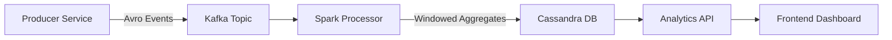

# Real-Time Data Flow Architecture

This document explains how live data flows through the **Real-Time Event Streaming & Analytics Platform**, from generation to visualization.

## 🔄 Data Flow Pipeline



## 📍 Component Breakdown

### 1. Producer Service (Port 8083)
**Location**: `producer/src/main/java/com/platform/producer/DataReplayService.java`

The Producer generates synthetic financial transactions and publishes them to Kafka.

**Key Behavior**:
- Runs on a `@Scheduled(fixedRate = 200)` timer (5 times per second).
- Generates **3 events per tick** (bursts) for high-volume simulation.
- Sends Avro-serialized `FinancialTransactionEvent` objects to the `financial-transactions` topic.

---

### 2. Kafka Broker (Port 9092)
**Location**: `docker/docker-compose.yml`

Kafka acts as the durable, fault-tolerant message bus.

**Key Behavior**:
- Topic: `financial-transactions`
- Schema Registry (Port 8081) manages Avro schemas for data contracts.

---

### 3. Spark Processor (Streaming Job)
**Location**: `processor/src/main/java/com/platform/processor/SparkAnalyticsJob.java`

The Processor is a Spark Structured Streaming job that performs real-time aggregation.

**Key Behavior**:
- Reads from Kafka's `financial-transactions` topic.
- Parses JSON/Avro events into a structured DataFrame.
- Applies a **5-minute tumbling window** with a 10-minute watermark for late arrivals.
- Aggregates `total_revenue` and `transaction_count` per `merchant_id`.
- Writes results to Cassandra's `analytics.merchant_aggregates` table in `update` output mode.
- Triggers every 1 minute.

---

### 4. Cassandra (Port 9042)
**Location**: `docker/init.cql`

Cassandra is the persistent store for aggregated analytics.

**Schema**:
```sql
CREATE TABLE analytics.merchant_aggregates (
    merchant_id text,
    window_start timestamp,
    total_revenue bigint,
    transaction_count bigint,
    PRIMARY KEY (merchant_id, window_start)
) WITH CLUSTERING ORDER BY (window_start DESC);
```

---

### 5. Analytics API (Port 8082)
**Location**: `api/src/main/java/com/platform/api/DashboardController.java`

The API exposes REST endpoints for the frontend to query aggregated data.

**Endpoints**:
- `GET /api/v1/analytics/health` → Returns `UP` if API is healthy.
- `GET /api/v1/analytics/merchant/{merchantId}` → Returns aggregated stats for a merchant.

---

### 6. Frontend Dashboard (Port 3000)
**Location**: `frontend/src/App.tsx`

The Frontend is a React + Vite application styled as an Arch Linux terminal.

**Key Behavior**:
- Displays an interactive command-line interface with system info.
- Shows live status cards for Kafka, Spark, Cassandra, and Latency.
- Proxies `/api/*` requests to the Analytics API at `http://localhost:8082`.

---

## 🚀 Startup Sequence

When you run `./start.sh`, the following happens:

1. **Docker Infrastructure**: Starts Kafka, Zookeeper, Cassandra, Redis, Spark Master/Worker, Schema Registry.
2. **Cassandra Schema**: After Cassandra is ready, `init.cql` is executed to create the `analytics` keyspace and `merchant_aggregates` table.
3. **Maven Build**: Compiles all modules including Avro schema generation.
4. **Producer**: Starts sending transaction bursts to Kafka.
5. **Processor**: Starts consuming from Kafka, aggregating, and writing to Cassandra.
6. **API**: Starts serving REST endpoints from Cassandra data.
7. **Frontend**: Starts the Vite dev server to serve the dashboard.

---

## ⚠️ Important Notes

- **Spark UI is disabled** (`spark.ui.enabled=false`) to avoid servlet classpath conflicts with Java 17.
- The Spark job runs in **local[*]** mode for development. For production, configure a Spark cluster master URL.
- Data takes up to **1 minute** to appear in Cassandra due to the Spark trigger interval.
